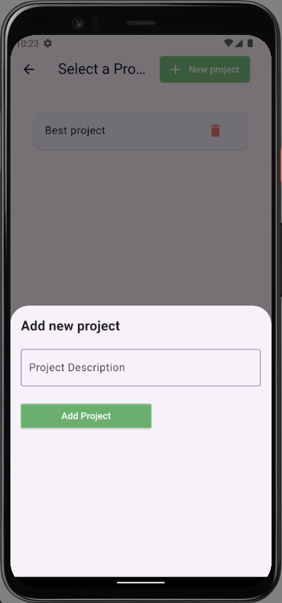
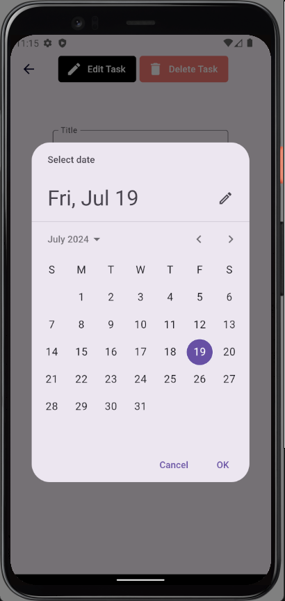

## Ce qui contient le Readme
- [Ce qui contient le Readme](#ce-qui-contient-le-readme)
- [Description du projet](#description-du-projet)
- [References](#references)
- [Ce qui est fait](#ce-qui-est-fait)
- [Outils et Technologies utilisées](#outils-et-technologies-utilisées)
- [Captures d'écran de l'application (Multi plateforme)](#captures-décran-de-lapplication-multi-plateforme)
- [Schéma de la base de donnée](#schéma-de-la-base-de-donnée)

## Description du projet
**En 5 jours**, développer un outil complet de suivi de projet (Clone Trello) avec des fonctionnalités telles que la gestion des utilisateurs, des tableaux de bord multiples (Todo, In progress, Done), l'affectation des tâches, et les notifications par email.

## References 
* Membres 
  * [M'hamed LEHBAB](https://github.com/GitGud31)
  * [Oualid RAHHOUTI](https://github.com/Oualidrahhouti)
* [Le projet (Clone Trello)](https://nowledgeable.com/student/sequence/9091/do)
* [La repository du backend](https://github.com/GitGud31/exam-h3)
* [La repository du micro service d'email](https://github.com/GitGud31/h3-exam-email-sender)

## Ce qui est fait
* **Application Multi Plateform** (Web, Windows, Android et iOS).
* CRUD Profiles.
* CRUD Projects.
* CRUD Taches (titre, description, priorité, deadline,... etc).
* **Drag and Drop** : faire glisser les taches d'une colonne a une autre.
* Authentification (JWT) et Autorisation des routes.
* Gestion des mots de passe.
* **Systeme d'envoie de mail**.
* **Projet distribué en Microservice**.
* Les écrans sont sécurisé par un Authentication Guard.
* Validation des champs a remplir.
* Tests unitaires et Tests d'intégrations.
* Suivi des bonnes pratiques et des design patterns.

## Outils et Technologies utilisées
* Frontend : Flutter.
* Backend : Spring boot.
* Base de donnée : Postgres.
* Systeme de versionning : Git.
* Docker.
* Documentation : Swagger.
* Postman.
  
## Captures d'écran de l'application (Multi plateforme)

**Windows**

**Web**

**Android & iOS** 

## Schéma de la base de donnée

